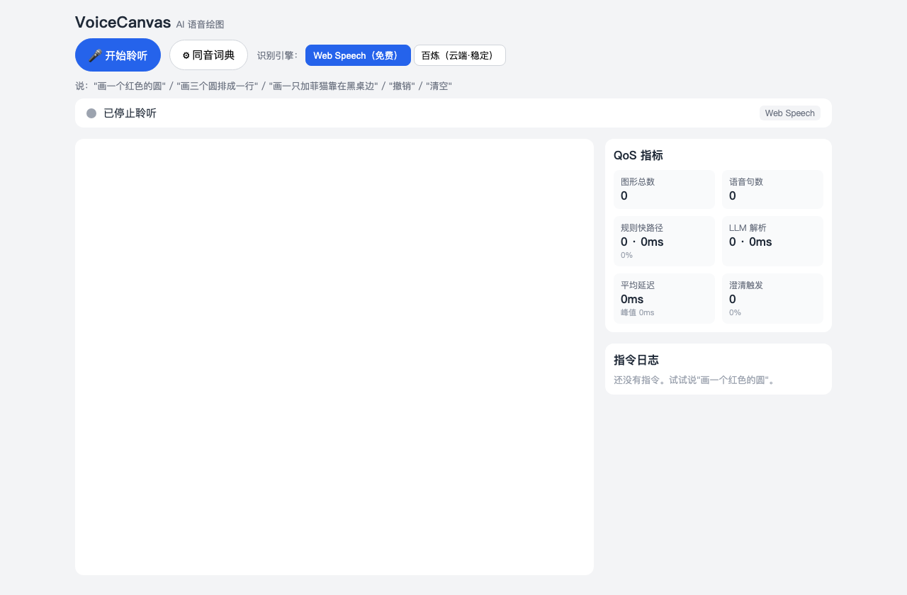
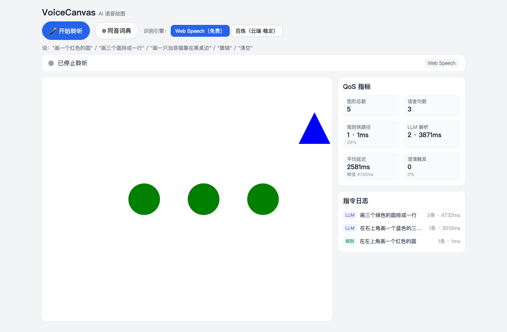
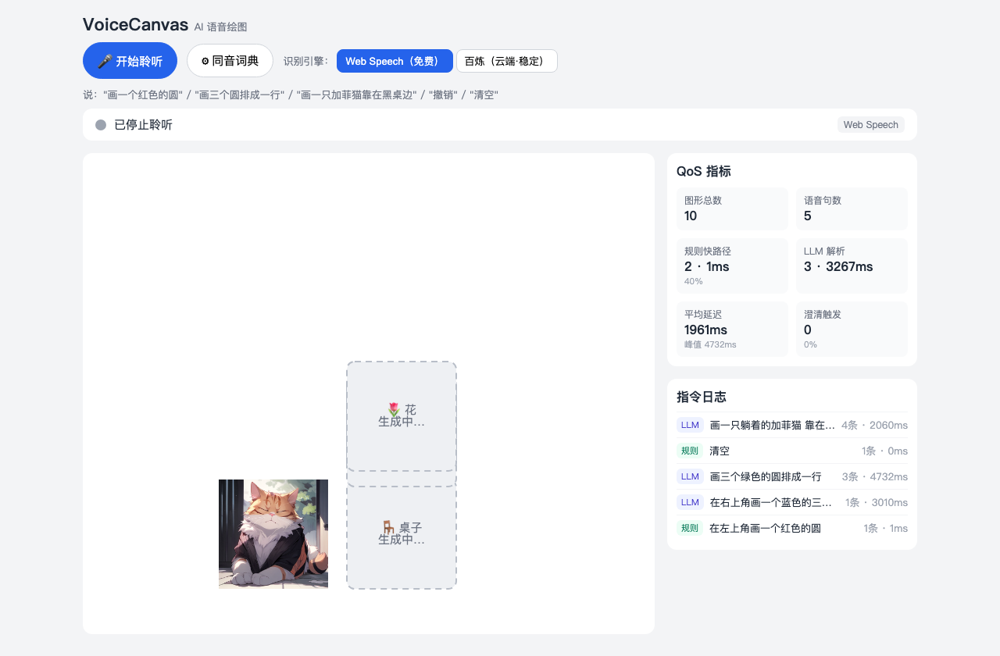
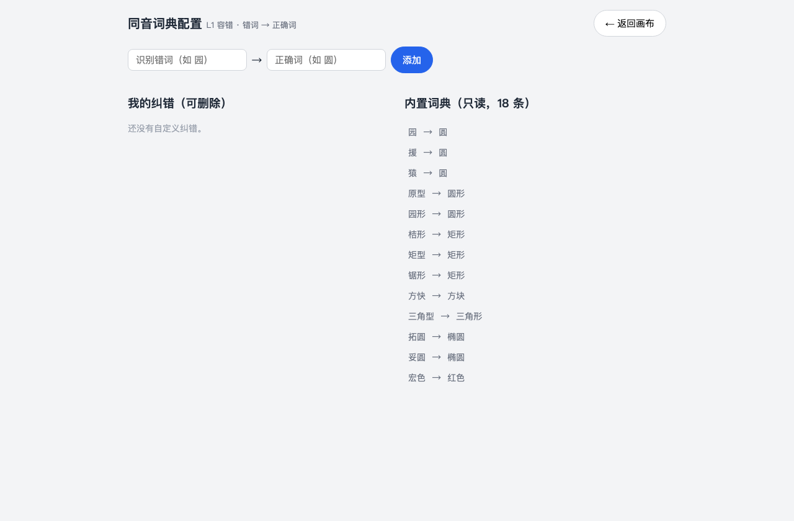

# VoiceCanvas — AI 语音绘图工具

一款 **纯语音控制** 的绘图工具：用户不使用鼠标或键盘，仅通过语音指令完成绘图创作。校园招聘项目试题。

> 📋 **评审请先看** [`HANDOFF.md`](./HANDOFF.md) — 交付说明：计划支持哪些指令能力、最终实现了哪些、未完成部分的原因，以及验收指引。
> 完整设计见 [`design.md`](./design.md)：支持的指令能力、系统架构、容错策略、延迟优化、复杂指令拆解。
> 演示脚本见 [`DEMO.md`](./DEMO.md)。

## 演示视频

▶️ [`demo.mp4`](./demo.mp4) — 纯语音绘图实录（建议下载观看；GitHub 网页端点开后可直接播放）。

## 界面截图

| 主界面 | 基础 + 复杂指令拆解 |
| --- | --- |
|  |  |
| 左侧画布 + 右侧 QoS 指标与指令日志；顶部可切换识别引擎 | "在左上角画红圆"（规则）/"画三个绿圆排成一行"（LLM 拆成 3 条） |

| 语义场景生成 | 同音词典配置页 |
| --- | --- |
|  |  |
| "画一只加菲猫靠在黑桌边，桌上一盆花"→ 场景图分解 + 文生图；加菲猫已渲染，桌子/花异步回填中（乐观渲染） | L1 容错词典可视化增删改（错词 → 正确词） |

> 截图由 [`scripts/screenshots.py`](./scripts/screenshots.py)（Playwright）自动生成。

## 能力一览

- **第 1 档**：语音创建圆/矩形/椭圆/三角/直线/文字，调整颜色、尺寸、位置，删除、清空、撤销、重做
- **第 2 档**：一句话拆多步（"画三个圆排成一行"）、相对引用（"把刚才那个往右移"）、修改已有图形、**语义场景生成**（"画一只加菲猫靠在黑桌边，桌上一盆花" → 牡丹）
- **容错**：L1 同音词典归一化 + L2 LLM 容错解析 + L3 低置信度澄清回问
- **低延迟**：规则快路径（<50ms）+ 乐观渲染 + 占位骨架 + 异步回填

## 技术栈

| 层 | 选型 |
| --- | --- |
| 前端 | React + Vite + TypeScript + react-konva |
| 后端 | Python Flask（薄代理，持有密钥） |
| ASR | Web Speech API（免费）/ 阿里百炼 paraformer（云端，规划中） |
| 指令解析 | MiniMax-M3（Anthropic 兼容） |
| 实体生图 | MiniMax image-01-live |

## 架构

```
浏览器/WebView ──/api──▶ Flask 薄代理（持有 Key）──▶ MiniMax-M3 / image-01-live / 百炼
   │  ASR(Web Speech)                                        前端不接触任何 Key
   └─ 归一化(L1) → 规则快路径 或 /api/parse(L2) → resolveScene → Konva 渲染
```

## 快速开始

### 1. 配置密钥

```bash
cp .env.example .env      # 填入 MiniMax / 阿里百炼 Key；.env 已 gitignore，绝不入库
```

### 2. 启动后端（Flask，默认 :5001）

```bash
cd backend
python3.11 -m pip install -r requirements.txt
python3.11 app.py
# 验证：curl localhost:5001/api/health ；联网校验 Key：python3.11 ../scripts/verify_keys.py
```

### 3. 启动前端（Vite，默认 :5173，/api 代理到后端）

```bash
cd frontend
npm install
npm run dev
```

浏览器打开 http://localhost:5173 （**桌面用 Chrome/Edge**，需允许麦克风权限），点"🎤 开始聆听"，说出绘图指令。

### Android App（WebView 套壳）

`android/` 提供可在 Android Studio 一键构建的 WebView 套壳工程：加载前端并授予麦克风权限，手机端默认走百炼云端 ASR（WebView 不支持 Web Speech）。构建与配置见 [`android/README.md`](./android/README.md)。

## 测试

```bash
cd backend  && python3.11 -m pytest    # 36 用例
cd frontend && npm test                # 97 用例
```

共 **133 个单元测试**，外部 API 全部 mock，离线可跑。

## 开发约定

- 每次修改以 **PR** 形式提交，不直推 `main`。
- 提交信息中文说明，固定前缀：`[feat]` `[fix]` `[docs]` `[refactor]` `[test]` `[chore]`。
- 密钥仅存于 `.env`，**绝不入库**。

## 状态

核心功能已实现，含双 ASR 引擎（Web Speech + 百炼云端）与 Android WebView 套壳工程（`android/`，需 Android Studio 构建为 APK）。QoS 独立看板等为后续项，原因见 `design.md §18`。

## AI 协作说明

本项目在 **Claude Code（Claude Opus）** 辅助下完成，采用"人定方向、AI 落地、人工验收"的协作方式：

- **需求与设计共识**：先以"逐项拷问"（grill）方式把设计决策一条条敲定——ASR 选型、指令理解 Hybrid 方案、DSL 结构、渲染与延迟模型、容错三层、技术栈等，结论沉淀为 [`design.md`](./design.md)。方向、取舍、范围由人把控。
- **实现方式**：AI 按共识逐个 PR 落地（PR #1–#9），每个 PR 聚焦一个功能单元，**自带单元测试**（外部 API 全部 mock），并对关键链路做真实接口验证（MiniMax 解析/生图、百炼 ASR 端点）。
- **协作规范**：所有改动经 PR 提交、中文说明、类型前缀；密钥仅存 `.env`、绝不入库——均由人设定为硬约束。
- **人工验收边界**：AI 无法验证依赖真实硬件的环节（**真实麦克风音频识别**、移动端真机），这些由人工真机验收；文档对"已实现 / 受限未做 / 主动不做"如实标注（见 `design.md §17/§18`）。

> 即：AI 负责实现与文档、并为可自动化的部分写测试；人类负责设计决策、代码审阅、合并与真机验收。所有产物以 `design.md` 为准、代码追随文档。
